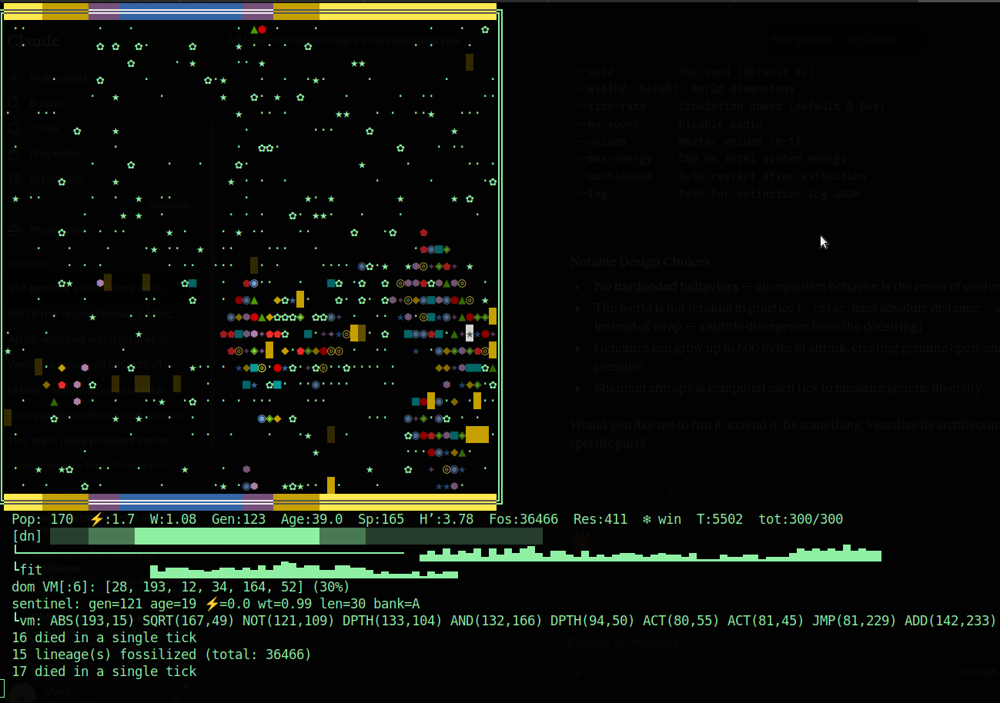

# syntropy — self-evolving ecosystem in your terminal

Digital organisms run Turing-complete VM programs (46 opcodes) on a shared 2D grid.
No fitness function. No selection pressure. No objective. Evolution emerges bottom-up.



## Run

```bash
python3 syntropy.py
```

Ctrl+C to stop. Extinction summary on exit.

### Options

| Flag | Default | Description |
|------|---------|-------------|
| `--seed N` | time | Random seed |
| `--width N` | 72 | Grid width |
| `--height N` | 26 | Grid height |
| `--tick-rate N` | 0.06 | Seconds per tick |
| `--volume N` | 0.3 | Sound volume 0–1 |
| `--no-sound` | — | Disable audio |
| `--max-energy N` | 200 | System-wide energy cap |
| `--max-movement-speed N` | 0 | Max moves/tick/org (0=unlimited) |
| `--continuous` | — | Auto-restart on extinction |
| `--log FILE` | extinction.json | Extinction log path |

## Architecture

### GenomeVM — 46 opcodes

Programs are lists of bytes grouped in 3-byte instructions: `[opcode, a1, a2]`.
Execution is async per organism per tick. Energy = gas (budget up to `min(energy×0.4, 8.0)`).

| Cat | Opcodes |
|-----|---------|
| Flow | NOP, JMP, JZ, JG, JL, JNE, CALL, RET, HALT |
| Math | MOV, ADD, SUB, MUL, DIV, MIN, MAX, ABS, NEG, MOD, SQRT, EXP |
| Stack | PUSH, POP, DUP, DROP, SWAP, OVER, PICK, DEPTH |
| Bit | AND, OR, XOR, NOT, SHL, SHR, BIT |
| Compare | CMP |
| Random | RAND |
| Reg | IND, GEN, PC, SETPC, TICK |
| I/O | SENSE, ACT |
| Energy | ENERGY |

### Sensors (23)

Position, resources (food distance/direction), temperature, pressure, moisture, daylight,
organisms (density, distance, direction), population, predator/prey/kin proximity,
disease, season, terrain, traces, signals.

### Actions (12)

Move N/S/E/W, toward food, away from organisms, EAT, ATTACK, REPRODUCE, REST, SOUND.

### Weight system

All organisms start at `weight=1.0`. Movement cost = `0.02 × speed × weight × dissipation`
(speed = number of moves this tick, creating inertia). Each move burns `0.01 × speed` weight.
Eating food adds weight; eating other organisms transfers their mass (requires heavier attacker).
Weight = 0 → wasting death.

### Dual-bank DNA

Two genome banks per organism: `genome_a` (expressed) and `genome_b` (silent backup).
Active bank selected at birth. Gene conversion (2%/tick) copies a random byte from inactive to active,
providing automatic repair without explicit opcodes. Each bank mutates independently during reproduction.

### Traces & signals

Organisms deposit pheromones (trace=0.5/tick, decay ×0.95) detectable via TRACE sensor (radius 3).
EMIT action broadcasts a register value to nearby cells; SIGNAL sensor reads the buffer.
Enables communication, coordination, and memory sharing.

### Per-organism audio

3-band sound (bass/mid/treble) driven by SENSE→ACT SOUND. Environmental ambient audio
(pressure→bass, moisture→bass, temperature→mid, daylight→treble, season→sub-bass).
Async mixer with persistent `aplay` process and sample-accurate phase tracking.

### Economy

- INITIAL_RESOURCES=60, RESOURCE_REGEN=3, REPRODUCTION_THRESHOLD=6.0
- Summer upkeep 0.06/tick, winter 0.12/tick
- System-wide energy cap (default 200): total organism energy+fat scaled proportionally when exceeded
- Energy dissipation above 5.0: `1.0 + max(0, energy-5.0) × 0.15` — anti-hoarding pressure
- Per-opcode instruction costs: NOP=0.002 to DIV/RAND/SENSE=0.016; SENSE/ACT add variable cost from a1

### Ecology

- Non-toroidal world (edges clamp) — edge ecology
- Day/night cycle with horizontal bar visualization
- Seasons (summer/winter) affect temperature and upkeep
- Temperature gradient: latitude + season ± diurnal cosine
- Disease, immunity, territory, nests, fossils
- Horizontal gene transfer, spontaneous mutation, fighting overlap
- Weak auto-eat (30%+age bonus) and auto-reproduce (10% at 2× threshold) for bootstrap

## Visualization

| Glyph | Meaning |
|-------|---------|
| `·` | Food resource |
| `⬟` | Organism (varies by hue/energy) |
| `▲●★◆◉■⬢✦✧◈` | Species glyphs |
| `✿` | Corpse / special resource |
| `═══` | Top/bottom bars with day/night coloring |

Status line: Pop, avg energy, avg weight, generation, avg age, species count,
Shannon diversity, fossils, resources, season, tick, total system energy.

## Requirements

Python 3.10+. No external dependencies.
